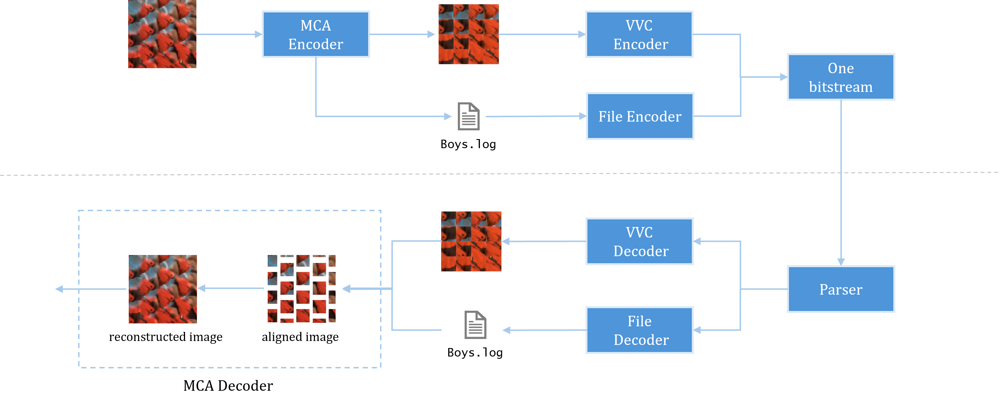

# MCA
The latest implementation of *Microimage Cropping and Aligning*.


#### Workflow

The work flow of  `MCA`  is as follows:



> [!NOTE]
>
> At the current stage, ZIP can be used as the file encoder/decoder.


#### Params Description

The params of  `.log`  file produced by  `MCA Encoder`  is as follows:

```c++
# The demo of TSPC sequences
Type:			TSPCCalibData			// sequence type
Frames:			10				// frames to be encoded
Width:			3976			        // raw image width
Height:			2956				// raw image height
Patch:			50				// crop patch size
diameter:		70				// diameter of MI
ltopx:			35				// Below is the layout info used to align image
ltopy:			36
rtopx:			3939.5
rtopy:			35.2
lbotx:			38.2
lboty:			2914.2
rbotx:			3935.6
rboty:			2919.3
    
    
# The demo of Raytrix sequences
Type:			RayCalibData			// sequence type
Frames:			1				// frames to be encoded
Width:			2048				// raw image width
Height:			2048				// raw image height
Patch:			16				// crop patch size
diameter:		23.202295303345		        // diameter of MI
rotation:		1.570796370506			// Below is the layout info used to align image
offsetx:		13.040943844572
offsety:		-20.348051920159
```

> [!CAUTION]
>
> I would like to mention that our  `MCA Decoder`  is still being optimized. However, no matter how much we optimize it, we will ensure that there is **only one** additional  `.log`  file generated after the  `MCA Encoder`.  We hope that the mobile side can reserve a good interface for this.


